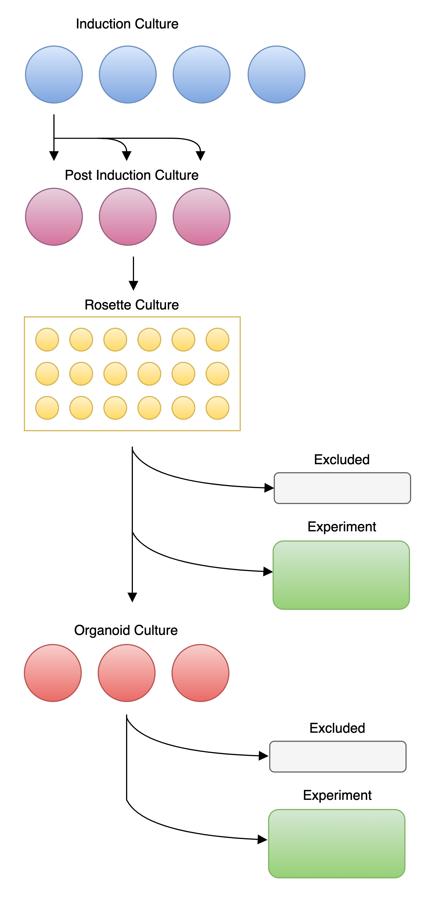
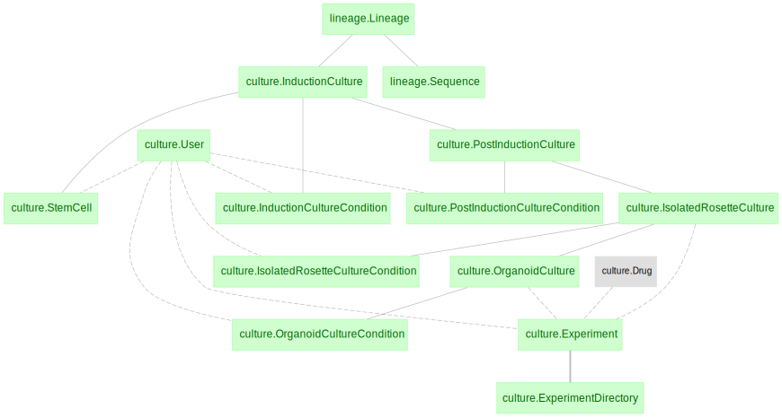
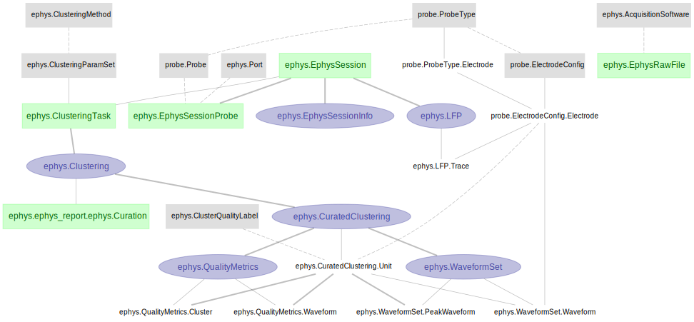

# DataJoint Workflow for Utah Lab

This is the central codebase for the **DataJoint Workflow for Utah Lab**. The pipelines are designed to manage and analyze data from the Utah lab, focusing on cerebral organoids characterization and electrophysiology data analysis.

The automated pipeline consists of several schemas and tables, covering multiple data modalities and/or DataJoint Elements.

- **Organoids generation pipeline**: The protocol for organoid generation includes inducing pluripotent stem cells (iPSCs) to form single neural rosettes (SNRs), which are then developed into organoids. 

This pipeline manages data from the organoid generation process, including iPSCs, SNRs, and organoids. It includes the following schemas:
  - `lineage`: Handles lineage and sequence metadata.
  - `culture`: Manages metadata for iPSCs, SNRs, and organoids, covering culture conditions, induction and post-induction details, media used, experiment timelines and directories, and drug concentrations.

- **Array Ephys pipeline**: This pipeline for array electrophysiology data analysis includes the following main steps:
  - `probe`: Manages the probes and metadata used for the electrophysiology recordings.
  - `ephys`: Manages the electrophysiology data and analysis results, including spike sorting and quality metrics.
    - `EphysRecording`: Represents raw electrophysiological recordings linked to specific probe insertions. `EphysRecordingFile`: Represents the raw data files associated with each recording.
    - `Preprocessing`: Applies preprocessing steps like filtering and artifact removal to raw data.
    - `Clustering`: Stores the spike sorting results.
    - `Curation`: Facilitates manual or automated curation of sorted spike data.
    - `QualityMetrics`: Calculates and stores quality metrics after the spike sorting.
    - `Unit`: Final output of curated, high-quality single-unit data.

- For more details, you can explore the pipeline architecture and data in the `EXPLORE` notebooks as Guest following the [Quick Start Guide](#quick-start-guide) below.

## Quick Start Guide

What are you aiming to achieve with the pipeline?

| User Type           | Description                                                                                                                                                    | Relevant Notebooks         |
| ------------------- | -------------------------------------------------------------------------------------------------------------------------------------------------------------- | -------------------------- |
| **Guest**           | Explore the data without installing anything. [Learn more](./docs/README.md#getting-started-as-a-guest).                                                       | `EXPLORE`                  |
| **Experimenter**    | Run the pipeline for your new experiment efficiently without diving into the code, including **instructions on uploading data to the cloud**.[Learn more](./docs/README.md#getting-started-as-a-experimenter). | `EXPLORE`                  |
| **Power-User**      | Gain deeper insights by running specific pipeline computations on the cloud or locally, and **understand how the data is processed**. [Learn more](./docs/README.md#getting-started-as-a-power-user).                   | `CREATE`, `RUN`, `EXPLORE` |
| **Developer/Admin** | Maintain and enhance the pipeline codebase, implement new features, and contribute actively to the project. [Learn more](./docs/README.md#getting-started-as-a-developer-or-admin).                                | `CREATE`, `RUN`, `EXPLORE` | 

## Summary on Getting Started with Works App

- _Goal_: **Explore the current pipeline architecture and results** without running new data or new analyses, and with no installation required.

- _Steps_:
  1. Ensure you have a [DataJoint Works account](https://accounts.datajoint.com/) before getting started.
  2. Log in [DataJoint Works platform](https://works.datajoint.com/) (no installation required) 
  3. In the `Notebooks` tab, run the `utah_organoids/notebooks/` notebooks. These notebooks showcase each pipeline modality and its results, for example:
        - `EXPLORE` notebooks to explore the curent pipeline architecture and results, e.g., `EXPLORE_pipeline_architecture.ipynb` to explore the main schemas that compound the pipeline architecture for this project.
## SciViz website

Data viewer for the Utah Organoids DataJoint pipeline. Please use the entry forms provided on the website to manually input relevant data entries.

<https://organoids.datajoint.com/>

## Citations

- If your work uses [SpikeInterface within the pipeline](https://github.com/datajoint/element-array-ephys/tree/datajoint-spikeinterface), cite the respective manuscript. For details, visit [here](https://spikeinterface.readthedocs.io/en/latest/references.html).
- For other tools integrated within the pipeline, cite their respective manuscripts and Research Resource Identifiers (RRIDs).
- For work utilizing DataJoint Python and/or Elements, cite the respective manuscripts and RRIDs. For details, visit [here](https://datajoint.com/docs/about/citation/).

DataJoint promotes integration and interoperability across neuroscience ecosystems, encouraging transparency and collaboration in research.

## Additional Resources

- [Official documentation for DataJoint](https://datajoint.com/docs/)
- [Interactive tutorials written in Python](https://github.com/datajoint/datajoint-tutorials)
- [Notebook for logical operators in DataJoint tables](https://github.com/datajoint-company/db-programming-with-datajoint/blob/master/notebooks/SQL%20Syntax%20for%20DataJoint%20Querying.ipynb)
- [DataJoint Table Tiers](https://datajoint.com/docs/core/datajoint-python/0.13/reproduce/table-tiers/)
- [DataJoint Common Commands](https://datajoint.com/docs/core/datajoint-python/0.13/query-lang/common-commands/)
- [DataJoint Operators](https://datajoint.com/docs/core/datajoint-python/0.13/query-lang/operators/)
- [DataJoint Populate Function](https://datajoint.com/docs/core/datajoint-python/0.14/compute/populate/)
- [Contribute documentation](https://datajoint.com/docs/about/contribute/)
- [Quality assurance principles in DataJoint](https://datajoint.com/docs/elements/management/quality-assurance/)
- [DataJoint External Storage for Large Data Objects](https://datajoint.com/docs/core/datajoint-python/0.14/sysadmin/external-store/)
